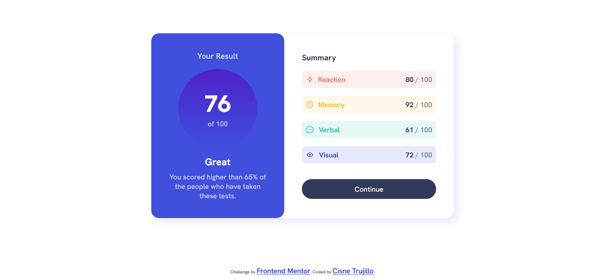

# Frontend Mentor - Results summary component solution

This is a solution to the [Results summary component challenge on Frontend Mentor](https://www.frontendmentor.io/challenges/results-summary-component-CE_K6s0maV). Frontend Mentor challenges help you improve your coding skills by building realistic projects. 

## Table of contents

- [Overview](#overview)
  - [The challenge](#the-challenge)
  - [Screenshot](#screenshot)
  - [Links](#links)
- [My process](#my-process)
  - [Built with](#built-with)
  - [What I learned](#what-i-learned)
  - [Continued development](#continued-development)
- [Author](#author)

## Overview

### The challenge

Users should be able to:

- View the optimal layout for the interface depending on their device's screen size
- See hover and focus states for all interactive elements on the page

### Screenshot

### Links

- Solution URL: [https://github.com/cisneConCorbata/frontendMentor-resultsSummary.git](https://github.com/cisneConCorbata/frontendMentor-resultsSummary.git)
- Live Site URL: [https://cisneconcorbata.github.io/frontendMentor-resultsSummary/](https://cisneconcorbata.github.io/frontendMentor-resultsSummary/)

## My process

### Built with

- Semantic HTML5 markup
- CSS custom properties
- Flexbox

### What I learned

- Centering with flexbox
- Using flex-direction

### Continued development

I'm interested in revisiting this project once I have a better grasp on js

## Author

- Frontend Mentor - [@cisneConCorbata](https://www.frontendmentor.io/profile/cisneConCorbata)
- Twitter - [@cisneConCorbata](https://www.twitter.com/cisneConCorbata)